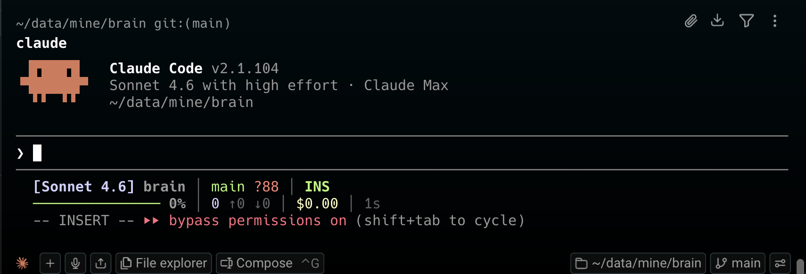

# claude-code-statusline

Beautiful, informative status lines for [Claude Code](https://code.claude.com). One command to install.

```
[Opus 4.6] my-app │ main +2 ~3 │ INS
━━━━━━━──────── 42% │ 1.2M ↑0.8M ↓0.4M │ $0.83 │ 56m13s
5h ━━━━━━── 72% 1h30m │ 7d ━━━───── 45% 48h0m
```




## Quick Start

### One-liner install (recommended)

```bash
curl -fsSL https://raw.githubusercontent.com/cubxxw/claude-code-statusline/main/install.sh | bash
```

### Choose a preset

```bash
curl -fsSL https://raw.githubusercontent.com/cubxxw/claude-code-statusline/main/install.sh | bash -s -- full
```

### Or clone and install locally

```bash
git clone https://github.com/cubxxw/claude-code-statusline.git
cd claude-code-statusline
./install.sh full
```

### Or just tell Claude Code

> **Paste this into Claude Code and it does everything for you:**

```
Install my statusline from https://github.com/cubxxw/claude-code-statusline — use the full preset
```

## Presets

### `minimal` — Single line

```
[Opus 4.6] my-app ━━━━━── 42% $0.83
```

One line. Model, directory, context bar, cost. For those who want information without distraction.

### `compact` — Two lines

```
[Opus 4.6] my-app │ main +2 ~3 │ INS
━━━━━━━──────── 42% │ 1.2M │ $0.83 │ 56m13s
```

Adds git status, vim mode, tokens, and session duration.

### `full` — Three lines (default)

```
[Opus 4.6] my-app │ main +2 ~3 ?1 │ INS
━━━━━━━──────── 42% │ 1.2M ↑0.8M ↓0.4M │ $0.83 │ 56m13s
5h ━━━━━━── 72% 1h30m │ 7d ━━━───── 45% 48h0m
```

Everything: git details, token breakdown (total/in/out), rate limits with reset countdown. Third line only appears when rate limit data exists (Pro/Max subscribers).

### `powerline` — Three lines, powerline style

```
 Opus 4.6  my-app │ main +2 ~3 │ INS
━━━━━━━──────── 42% │ 1.2M ↑0.8M ↓0.4M │ $0.83 │ 56m13s
5h ━━━━━━── 72% 1h30m │ 7d ━━━───── 45% 48h0m
```

Same data as `full`, with powerline-inspired segment separators.

## What's displayed

| Element | Description | Presets |
|---------|-------------|:-------:|
| **Model** | `[Opus 4.6]` — auto-shortened from "Claude Opus 4.6" | all |
| **Directory** | Current working directory basename | all |
| **Git branch** | Current branch name | compact, full, powerline |
| **Git status** | `+staged ~modified ?untracked` file counts | compact, full, powerline |
| **Vim mode** | `NOR` / `INS` / `VIS` / `REP` | compact, full, powerline |
| **Context bar** | `━━━━━──────` with green/yellow/red thresholds | all |
| **Context %** | Percentage of context window used | all |
| **Tokens** | Total consumed, with `↑input ↓output` breakdown | compact (total only), full, powerline |
| **Cost** | Session cost in USD `$0.83` | all |
| **Duration** | Session wall-clock time `56m13s` | compact, full, powerline |
| **Rate limits** | 5h/7d usage bars with reset countdown | full, powerline |

## Color Thresholds

Progress bars change color based on usage:

| Usage | Color | Meaning |
|:-----:|:-----:|---------|
| 0-69% | Green | Comfortable |
| 70-89% | Yellow | Getting warm |
| 90-100% | Red | Running low |

## Manual Configuration

If you prefer to set things up yourself:

### 1. Copy the script

```bash
cp presets/full.sh ~/.claude/statusline-command.sh
chmod +x ~/.claude/statusline-command.sh
```

### 2. Edit `~/.claude/settings.json`

```json
{
  "statusLine": {
    "type": "command",
    "command": "sh $HOME/.claude/statusline-command.sh"
  }
}
```

### 3. Restart Claude Code

## One-liner statuslines (no script file)

Don't want a script file? Paste these directly into `settings.json`:

**Model + Context %:**
```json
{
  "statusLine": {
    "type": "command",
    "command": "jq -r '\"[\\(.model.display_name)] \\(.context_window.used_percentage // 0 | floor)% context\"'"
  }
}
```

**Token counter:**
```json
{
  "statusLine": {
    "type": "command",
    "command": "jq -r '((.context_window.total_input_tokens // 0) + (.context_window.total_output_tokens // 0)) as $t | if $t >= 1000000 then \"\\($t / 1000000 | . * 10 | floor / 10)M\" elif $t >= 1000 then \"\\($t / 1000 | floor)K\" else \"\\($t)\" end | \"[\\(.model.display_name)] \\(.) tokens\"'"
  }
}
```

See [examples/one-liners.md](examples/one-liners.md) for more.

## Python alternative

Prefer Python? There's a Python implementation with identical features:

```bash
cp examples/python-statusline.py ~/.claude/statusline.py
```

```json
{
  "statusLine": {
    "type": "command",
    "command": "python3 $HOME/.claude/statusline.py"
  }
}
```

## Available JSON fields

Claude Code pipes session data as JSON to your script's stdin. Here are the key fields:

| Field | Description |
|-------|-------------|
| `model.display_name` | Model name (e.g., "Opus 4.6") |
| `workspace.current_dir` | Current working directory |
| `context_window.used_percentage` | Context usage 0-100 |
| `context_window.total_input_tokens` | Cumulative input tokens |
| `context_window.total_output_tokens` | Cumulative output tokens |
| `context_window.context_window_size` | Max context (200K or 1M) |
| `cost.total_cost_usd` | Session cost in USD |
| `cost.total_duration_ms` | Session duration |
| `cost.total_lines_added` | Lines added |
| `cost.total_lines_removed` | Lines removed |
| `rate_limits.five_hour.*` | 5h rate limit (Pro/Max) |
| `rate_limits.seven_day.*` | 7d rate limit (Pro/Max) |
| `vim.mode` | NORMAL / INSERT |
| `session_id` | Stable session identifier |

Full reference: [docs/json-fields.md](docs/json-fields.md)

## Requirements

- **jq** — JSON parser (`brew install jq` / `apt install jq`)
- **git** — for branch/status display (optional)
- **bash** — `/bin/bash` (standard on macOS/Linux)

## Testing

Test any preset with mock data:

```bash
echo '{"model":{"display_name":"Claude Opus 4.6"},"workspace":{"current_dir":"'$HOME'/my-project"},"cost":{"total_cost_usd":0.83,"total_duration_ms":3373000},"context_window":{"used_percentage":42,"total_input_tokens":850000,"total_output_tokens":320000},"vim":{"mode":"NORMAL"},"rate_limits":{"five_hour":{"used_percentage":12,"resets_at":'$(($(date +%s)+14400))'},"seven_day":{"used_percentage":7,"resets_at":'$(($(date +%s)+518400))'}}}' | sh presets/full.sh
```

## Project Structure

```
claude-code-statusline/
├── README.md              # You are here
├── install.sh             # One-command installer
├── LICENSE                # MIT
├── presets/
│   ├── minimal.sh         # 1-line: model, dir, bar, cost
│   ├── compact.sh         # 2-line: + git, tokens, time
│   ├── full.sh            # 3-line: + rate limits (default)
│   └── powerline.sh       # 3-line: powerline style
├── examples/
│   ├── one-liners.md      # JSON one-liner configs
│   └── python-statusline.py  # Python implementation
└── docs/
    ├── json-fields.md     # Complete JSON field reference
    └── configuration.md   # Configuration guide
```

## Contributing

PRs welcome! Ideas:

- New preset themes (catppuccin, nord, dracula, gruvbox)
- More language implementations (Node.js, Ruby, Go)
- Clickable hyperlinks (OSC 8) for terminals that support them
- Windows PowerShell preset

## License

MIT
